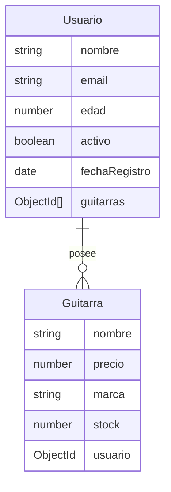

# Proyecto API de Guitarras y Usuarios

Esta API permite gestionar una base de datos de **Usuarios** y **Guitarras**, con una relación uno a muchos. Cada usuario puede tener múltiples guitarras, y cada guitarra pertenece a un único usuario.

## Descripción del Proyecto

Esta API está construida con **Node.js** y **Express**, y utiliza **MongoDB** con **Mongoose** para la gestión de la base de datos. El objetivo es proporcionar una API RESTful que permita crear, leer, actualizar y eliminar (CRUD) tanto usuarios como guitarras, manteniendo una relación de propiedad entre ellos.

## Prerrequisitos o Dependencias

Para ejecutar este proyecto, asegúrate de tener instalado lo siguiente:

- **Node.js** (versión 14 o superior)
- **MongoDB** (preferiblemente MongoDB Atlas para conexión remota)
- **NPM** (versión 6 o superior)

## Instalación del Proyecto

Sigue estos pasos para configurar y ejecutar el proyecto:

```bash
# Clonar el repositorio
git clone https://github.com/brayandiazc/musicstore-api-node.git

# Navegar al directorio del proyecto
cd musicstore-api-node

# Instalar dependencias
npm install
```

## Configuración del Entorno

Copia el archivo de ejemplo y ajusta la URI de MongoDB con tus credenciales:

```bash
cp .env.example .env
```

Contenido esperado del `.env`:

```bash
PORT=3000
MONGODB_URI=mongodb+srv://<usuario>:<contraseña>@cluster0.mongodb.net/musica?retryWrites=true&w=majority
```

## Instrucciones para Ejecutar el Proyecto

Para ejecutar el servidor en modo de desarrollo, utiliza el siguiente comando:

```bash
npm run dev
```

Una vez arrancado, hay un healthcheck en `GET /` que responde
`{ "status": "ok" }` — útil para verificar que la API está viva.

## Scripts disponibles

| Script                  | Qué hace                                  |
| ----------------------- | ----------------------------------------- |
| `npm start`             | Inicia el servidor (producción)           |
| `npm run dev`           | Servidor con recarga (nodemon)            |
| `npm test`              | Ejecuta los tests (Jest)                  |
| `npm run test:coverage` | Tests con reporte de cobertura            |
| `npm run lint`          | Analiza el código con ESLint              |
| `npm run lint:fix`      | Corrige problemas de lint autocorregibles |
| `npm run format`        | Formatea el código con Prettier           |

Las convenciones de calidad y testing se documentan en
[`docs/conventions/quality-tooling.md`](docs/conventions/quality-tooling.md) y
[`docs/conventions/testing.md`](docs/conventions/testing.md).

## Estructura del Proyecto

Este proyecto sigue una estructura basada en el patrón **MVC** (Model-View-Controller) para mejorar la organización y escalabilidad.

```
musicstore-api-node/
├── controllers/          # Controladores de lógica de negocio
│   ├── guitarraController.js
│   └── usuarioController.js
├── models/               # Modelos Mongoose
│   ├── Guitarra.js
│   └── Usuario.js
├── routes/               # Rutas del servidor
│   ├── guitarra.js
│   └── usuario.js
├── middleware/           # asyncHandler y errorHandler (manejo central de errores)
├── utils/                # AppError (error con código HTTP)
├── config/               # Configuración de conexión a MongoDB
│   └── db.js
├── tests/                # Tests (Jest + Supertest)
├── docs/                 # Documentación del proyecto
├── app.js                # App Express (middlewares, rutas, errores) — exportable/testeable
├── index.js              # Punto de entrada: conecta a la BD y arranca el servidor
├── .env                  # Variables de entorno (no versionado)
└── package.json          # Dependencias y scripts del proyecto
```

## Diagrama de Base de Datos

El siguiente diagrama en **Mermaid** representa la estructura de la base de datos con la relación uno a muchos entre **Usuarios** y **Guitarras**:



## Detalles de los Modelos

### Modelo Usuario

- **nombre**: Obligatorio, longitud mínima de 3 caracteres y máxima de 50 caracteres.
- **email**: Obligatorio, único, con validación de formato.
- **edad**: Opcional, entre 18 y 100 años.
- **fechaRegistro**: Fecha de creación del usuario, por defecto es la fecha actual.
- **guitarras**: Arreglo de referencias al modelo Guitarra.
- **activo**: Campo booleano que indica si el usuario está activo, por defecto `true`.

### Modelo Guitarra

- **nombre**: Obligatorio, único, con longitud mínima de 3 caracteres y máxima de 50 caracteres.
- **precio**: Obligatorio, con un valor mínimo de 100 y máximo de 10000.
- **marca**: Opcional, longitud máxima de 30 caracteres.
- **stock**: Obligatorio, valor predeterminado de 0 y mínimo de 0.
- **usuario**: Referencia al usuario propietario de la guitarra.

## Instrucciones para Cargar la Base de Datos o Migrar los Modelos

Este proyecto no requiere migraciones adicionales ya que utiliza **Mongoose**, que automáticamente crea los esquemas en MongoDB. Asegúrate de que la conexión esté configurada correctamente en el archivo `.env`.

## Comandos para Cargar los Datos Semilla a la Base de Datos

Para crear un usuario y asociarle guitarras de ejemplo, puedes hacer una solicitud `POST` a las siguientes rutas:

1. **Crear Usuario** (`POST /api/usuarios`):

   ```json
   {
     "nombre": "Juan Perez",
     "email": "juan@example.com",
     "edad": 25,
     "fechaRegistro": "2023-10-25T00:00:00Z", // Puedes omitir este campo, ya que tiene un valor predeterminado
     "guitarras": ["<ID de la guitarra 1>", "<ID de la guitarra 2>"], // IDs de las guitarras que posee el usuario
     "activo": true
   }
   ```

2. **Crear Guitarra Asociada** (`POST /api/guitarras`):

   ```json
   {
     "nombre": "Gibson Les Paul",
     "precio": 1500,
     "marca": "Gibson",
     "stock": 3,
     "usuario": "<ID del usuario>"
   }
   ```

## Documentación

La documentación del proyecto vive en [`docs/`](docs/README.md):

- [Arquitectura](docs/architecture/architecture.md) · [Stack](docs/architecture/stack.md) · [Modelo de datos](docs/architecture/database.md) · [API](docs/architecture/api.md) · [Autenticación](docs/architecture/auth.md)
- [Convenciones](docs/conventions/README.md) · [Decisiones (ADR)](docs/decisions/README.md) · [Producto](docs/product/roadmap.md)

## Contribuir

Antes de contribuir, revisa:

- [CONTRIBUTING.md](CONTRIBUTING.md) — flujo de trabajo y cómo colaborar.
- [CODE_OF_CONDUCT.md](CODE_OF_CONDUCT.md) — código de conducta.
- [SECURITY.md](SECURITY.md) — cómo reportar vulnerabilidades.
- [CHANGELOG.md](CHANGELOG.md) — historial de cambios.

## Autor

- [Brayan Diaz C](https://github.com/brayandiazc)

## Licencia

Este proyecto está bajo la Licencia MIT - consulta el archivo [LICENSE.md](LICENSE) para más detalles.

---

⌨️ con ❤️ por [Brayan Diaz C](https://github.com/brayandiazc) 😊
