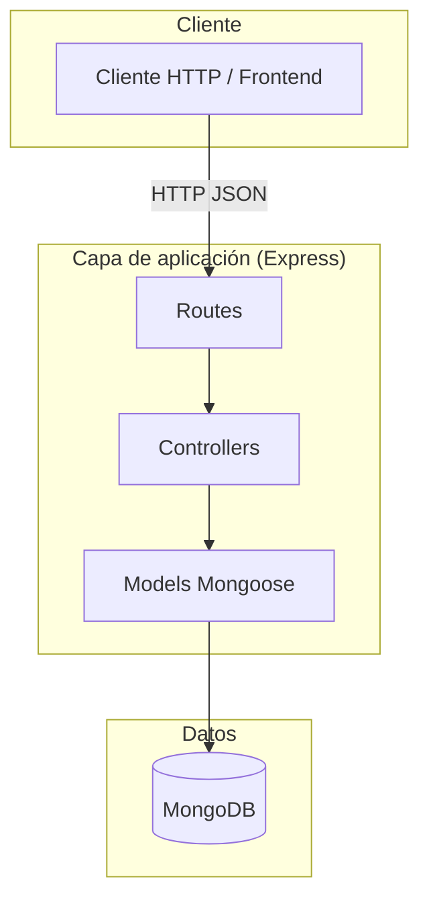
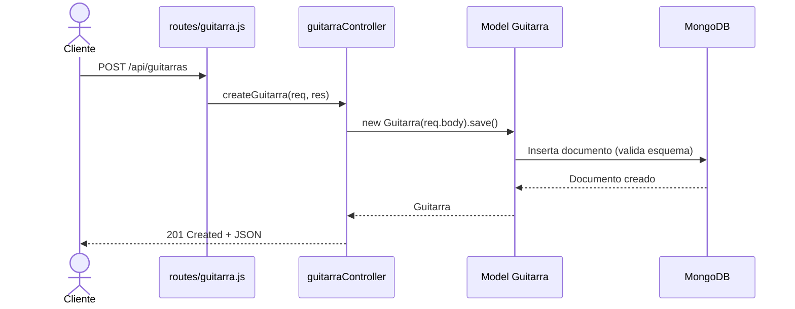

# musicstore-api-node — Arquitectura

> Vista de alto nivel de cómo está construido el sistema y cómo se reparten las
> responsabilidades. Para el stack real (versiones, librerías) ver
> [`stack.md`](stack.md). Para el negocio ver
> [`../product/business-model.md`](../product/business-model.md).
>
> **Última actualización**: 2026-07-02

## Diagrama



## Estructura del proyecto (patrón MVC)

```
musicstore-api-node/
├── controllers/   # Lógica de negocio (guitarraController, usuarioController)
├── models/        # Esquemas Mongoose (Guitarra, Usuario)
├── routes/        # Definición de rutas Express (guitarra, usuario)
├── middleware/    # asyncHandler y errorHandler (manejo centralizado de errores)
├── utils/         # AppError (error con código HTTP)
├── config/        # Conexión a MongoDB (db.js)
├── tests/         # Tests (Jest + Supertest)
├── app.js         # App Express (middlewares, rutas, manejo de errores) — exportable
├── index.js       # Punto de entrada: conecta a la BD y arranca el servidor
└── package.json
```

## Componentes

| Componente                | Responsabilidad                                                       | Tecnología     |
| ------------------------- | --------------------------------------------------------------------- | -------------- |
| `app.js`                  | Ensambla middlewares, rutas y el manejo de errores; exporta la app    | Express        |
| `index.js`                | Conecta a la BD y arranca el servidor                                 | Express        |
| `routes/`                 | Mapean cada verbo HTTP + ruta a un método del controlador             | Express Router |
| `controllers/`            | Implementan el CRUD; delegan errores a `next()` vía `asyncHandler`    | Node.js        |
| `models/`                 | Definen esquema, validaciones y relaciones sobre MongoDB              | Mongoose       |
| `middleware/errorHandler` | Traduce errores (validación, cast, único) a códigos HTTP consistentes | Express        |
| `utils/AppError`          | Error con `statusCode` para fallos esperados (p. ej. 404)             | Node.js        |
| `config/db.js`            | Establece la conexión a MongoDB usando `MONGODB_URI`                  | Mongoose       |

## Decisiones clave

| Decisión                                   | Razón                                                       |
| ------------------------------------------ | ----------------------------------------------------------- |
| Patrón MVC (routes → controllers → models) | Separa responsabilidades y facilita el crecimiento del CRUD |
| Validaciones en el esquema Mongoose        | Centraliza las reglas de datos junto al modelo              |
| Relación 1:N Usuario → Guitarra por `ref`  | Permite `populate` de las guitarras de cada usuario         |

> El detalle y las alternativas de cada decisión relevante se registran como
> ADRs en [`../decisions/`](../decisions/README.md).

## Reglas no negociables

- Toda validación de datos vive en el esquema Mongoose; los controladores no duplican reglas.
- Los controladores no capturan errores manualmente: los propagan con `asyncHandler`
  y el `errorHandler` central decide el código HTTP. Un solo lugar define el contrato de errores.
- Cada guitarra pertenece a un único usuario (`usuario` es obligatorio).
- Las credenciales de la base de datos nunca se versionan: van en `.env` (ver [`../conventions/secrets.md`](../conventions/secrets.md)).

## Flujo principal — crear una guitarra



## Referencias

- [`stack.md`](stack.md) — stack tecnológico y versiones.
- [`database.md`](database.md) — modelo de datos.
- [`auth.md`](auth.md) — autenticación y autorización.
- [`api.md`](api.md) — contrato de API.
- [`../conventions/`](../conventions/README.md) — convenciones de trabajo.
