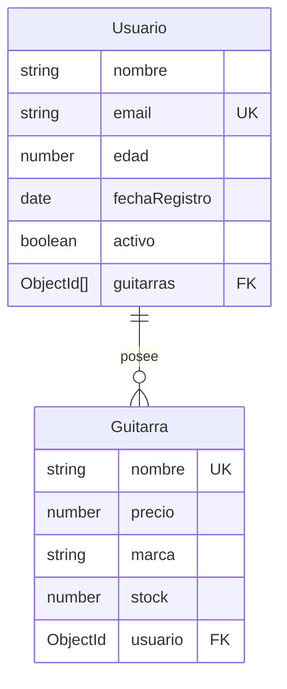

# Modelo de Datos

> Esquema, entidades y relaciones de **musicstore-api-node**.
> Para las **reglas y estándares** de modelado (nomenclatura, tipos, índices)
> ver [`../conventions/database.md`](../conventions/database.md).
>
> **Última actualización**: 2026-07-02

## Diagrama Entidad-Relación

## Entidades principales

### Usuario

- **Propósito**: representa a una persona que puede poseer guitarras.
- **Campos clave**:
  - `nombre` (String) — obligatorio, entre 3 y 50 caracteres.
  - `email` (String) — obligatorio, único, con validación de formato.
  - `edad` (Number) — opcional, entre 18 y 100.
  - `fechaRegistro` (Date) — por defecto la fecha actual.
  - `guitarras` (ObjectId[]) — referencias al modelo `Guitarra`.
  - `activo` (Boolean) — por defecto `true`.
- **Relaciones**: 1:N con `Guitarra` (un usuario posee muchas guitarras).

### Guitarra

- **Propósito**: representa una guitarra del catálogo, propiedad de un usuario.
- **Campos clave**:
  - `nombre` (String) — obligatorio, único, entre 3 y 50 caracteres.
  - `precio` (Number) — obligatorio, entre 100 y 10000.
  - `marca` (String) — opcional, máximo 30 caracteres.
  - `stock` (Number) — obligatorio, mínimo 0, por defecto 0.
  - `usuario` (ObjectId) — obligatorio, referencia al `Usuario` propietario.
- **Relaciones**: N:1 con `Usuario`.

> Ambos esquemas incluyen `timestamps: true`, por lo que Mongoose agrega
> `createdAt` y `updatedAt` automáticamente.

## Relaciones y cardinalidad

| Relación           | Cardinalidad | Notas                                                   |
| ------------------ | ------------ | ------------------------------------------------------- |
| Usuario → Guitarra | 1:N          | `Usuario.guitarras` referencia varias `Guitarra`        |
| Guitarra → Usuario | N:1          | `Guitarra.usuario` es obligatorio (integridad de dueño) |

Al consultar usuarios se usa `populate("guitarras", "nombre precio")` para
resolver las guitarras asociadas.

## Índices y restricciones

- `Usuario.email` — único.
- `Guitarra.nombre` — único.
- `Guitarra.usuario` — obligatorio (toda guitarra tiene dueño).
- Validaciones de longitud y rango declaradas en cada esquema.

## Migraciones y versionado del esquema

- No se usan migraciones: Mongoose crea las colecciones e índices a partir de
  los esquemas al arrancar. Basta con configurar `MONGODB_URI` en `.env`.

## Datos semilla (seeds)

- No hay script de seeds. Los datos de ejemplo se cargan vía `POST` a
  `/api/usuarios` y `/api/guitarras` (ver [`api.md`](api.md)).
